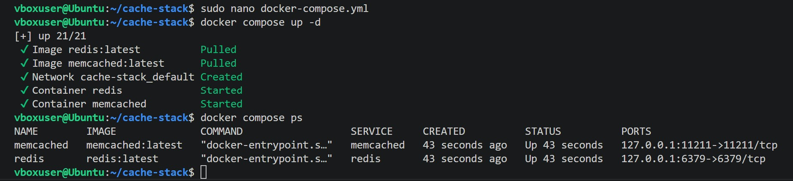
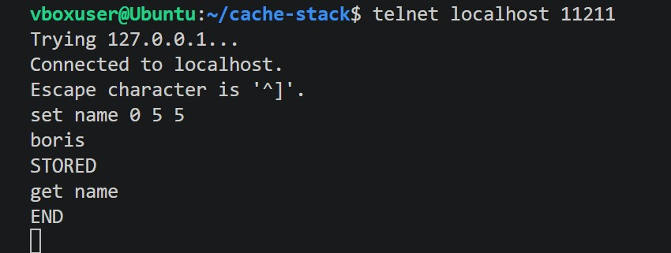
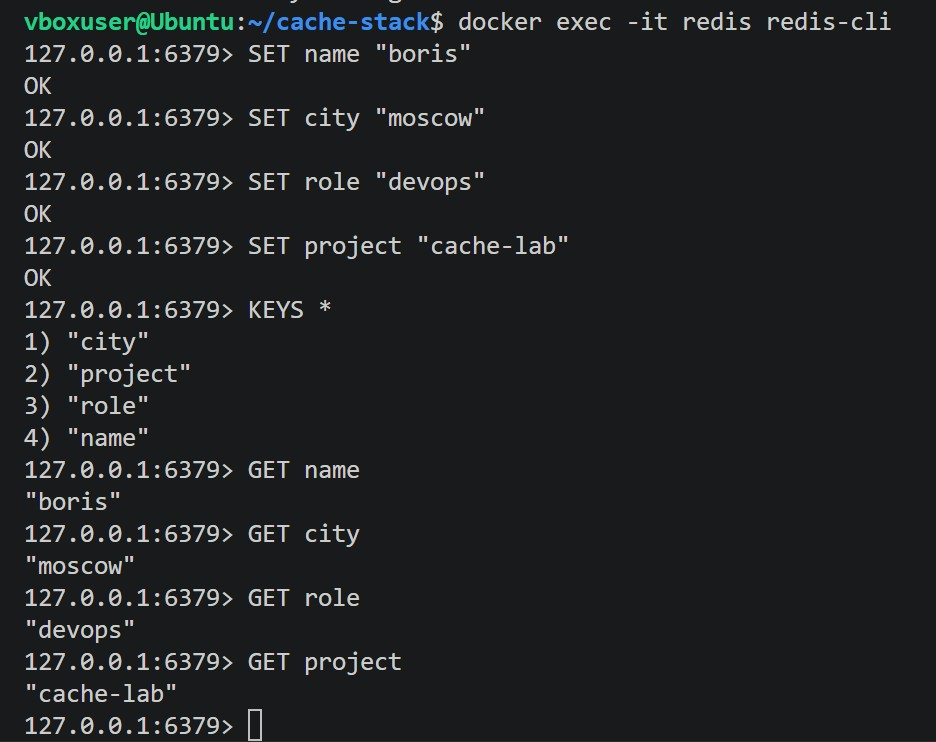
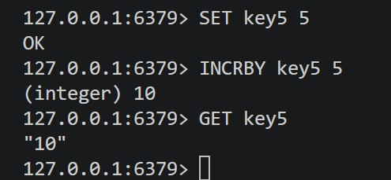

# Домашнее задание к занятию "Redis/Memcashed" - Борис Горелик

### Задание 1

Медленные ответы приложения, когда каждый запрос снова идёт в базу или выполняет тяжёлые вычисления. Кеш позволяет отдавать уже готовый результат из памяти значительно быстрее.

Перегрузка базы данных из-за большого числа одинаковых чтений. Кеширование уменьшает количество повторных запросов к БД и снижает нагрузку на серверы хранения.

Высокая нагрузка в пиковые периоды, например во время распродаж, релизов или всплесков трафика. В таких сценариях кеш помогает обслужить больше запросов без пропорционального роста нагрузки на backend.

### Задание 2

### Задание 3

### Задание 4

### Задание 5

